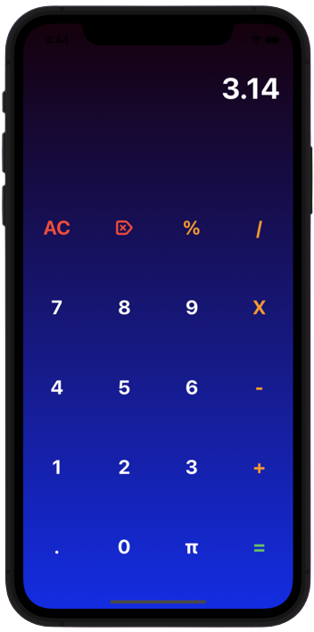

# Simple Calculator

## Description

Throughout this tutorial, you will be introduced to the IDE for iOS
development known as Xcode. Additionally, this tutorial introduces you to Auto
Layout, a tool used to dynamically position all of the views within your app.
Auto Layout is a very powerful tool and is explored in more depth in further
tutorials. Furthermore, you will familiarize yourself with special view elements
such as Stack Views and how you can better organize various subviews. Finally,
you'll be introduced to the national phenomenon of tipping 15, 18, or 20% at
restaurants.
